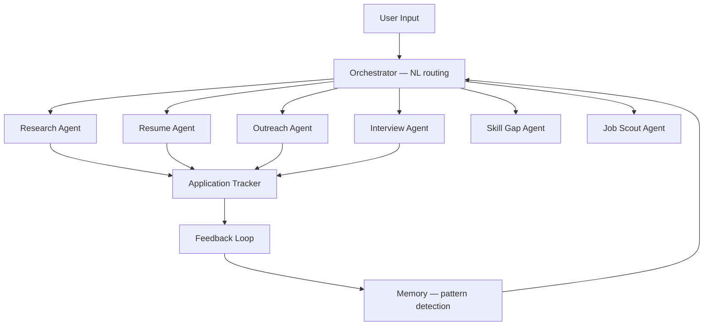

# Job Hunt OS 🎯
### Multi-Agent Job Search Intelligence Platform

> Stop managing a spreadsheet. Start running an intelligence loop.  
> Research companies, generate outreach, score fit, prep for interviews —  
> all from one system that learns from your outcomes.

[](https://python.org)
[](https://fastapi.tiangolo.com)
[](https://react.dev)
[](LICENSE)

**[→ Live App](https://job-hunt-os.vercel.app)** · 
**[→ API](https://your-backend-url)**

---

## The Problem

Job hunting is information chaos. Company research in one tab.
Outreach drafts in another. Applications in a spreadsheet.
Interview prep in a doc. No system learns from what works.

Job Hunt OS closes the loop — every action feeds back into
the system, improving future decisions automatically.

---

## Architecture



---

## Agents and Tools

### LOOP — Intelligence Layer

**Dashboard**
Real-time agent activity feed. Tracks response rate, rate lift,
active interviews, and loop cycles. Decision intelligence explains
why specific opportunities scored high.

**Applications Pipeline**
Kanban tracker: Bookmarked → Applied → Interview → Offer → Rejected.
Every stage transition feeds the feedback loop.

**Outreach Generator — Loop Agent 3**
7 outreach modes: Cold Email, Connection Request, Hidden Job Enquiry,
Post Application, Referral Ask, Founder Outreach, Coffee Chat.
Messages calibrated to historical response patterns. Every send tracked.

**Fit Scorer**
Scores any job for callback probability based on your actual
application history. Input: company, role, location, seniority,
required skills, tech stack, full JD. Output: probability score
with reasoning.

### TOOLS — Execution Layer

**Resume Studio — Resume Agent V2**
ATS scoring, gap analysis, A/B rewrites, JD decoding.
Four modes: Optimize (full pipeline), Quick Analyze, Parse Resume,
Analyze JD.

**Company Research — Research Agent V2**
Deep intel on any company: Company Intel, Why This Company framing,
Person Intel for specific contacts, Outreach Kit generation.

**Interview Prep — Interview Agent**
Role-specific questions generated using your actual projects as context.
Not generic prep — prep that references what you actually built.

**Skill Gap Analyzer — Skill Gap Agent V2**
Career roadmap with 30-60-90 plan. Single role analysis or
multi-role comparison. Takes JD, career goals, and market signals.

**Job Scout — Job Scout Agent**
Searches web for current openings based on your profile preferences.
Daily email digest at 8:00 AM.

**Orchestrator — Command Center**
Natural language → automatic agent routing. Type any task,
the orchestrator decides which agents to invoke.
Example: "Research Sarvam.ai and prep me for an AI Researcher role"
→ Research Agent + Interview Agent run automatically.

**Feedback Loop**
Rate any agent output. System detects patterns across 3+ outcomes
and adjusts future scoring and outreach calibration automatically.

---

## Design Decisions

**Why a closed feedback loop instead of standalone tools?**
Individual tools (resume optimizer, outreach generator) exist everywhere.
The insight is that job hunting generates data — which companies respond,
which outreach modes work, which roles convert — and that data should
improve every future decision. Closed loop architecture makes the system
smarter with every application logged.

**Why natural language orchestration?**
A job hunter shouldn't need to know which tool to use. "Prep me for
a Sarvam interview" should automatically trigger research + interview
prep. The orchestrator handles routing so the user thinks in tasks,
not tools.

**Why FastAPI + React instead of an existing framework?**
Full control over agent loop architecture, feedback storage,
and pattern detection logic. No abstraction hiding the mechanics.

---

## Known Limitations

- Feedback pattern detection requires 3+ outcomes — system memory
  is empty until enough data is logged
- Job Scout preferences field has a known serialization bug —
  displays [object Object] instead of parsed preferences
- Feedback loop timestamps showing Invalid Date — date parsing
  bug being fixed
- Response rate metrics at 0% until applications are actively logged
- Fit Scorer accuracy improves only after 5+ applications tracked

---

## Setup

```bash
git clone https://github.com/asheesh07/job_hunt_os
cd job_hunt_os

# Backend
cd backend
pip install -r requirements.txt
cp .env.example .env
uvicorn main:app --reload

# Frontend
cd ../frontend
npm install
npm run dev
```

---

## Future Work

- [ ] Fix Job Scout [object Object] preferences bug
- [ ] Fix Feedback Loop Invalid Date timestamp bug
- [ ] Persistent user profile across sessions
- [ ] Export outreach sequences as CSV
- [ ] Analytics dashboard — response rate trends over time
- [ ] LinkedIn integration for automated application tracking

---

## License

MIT — see [LICENSE](LICENSE)
